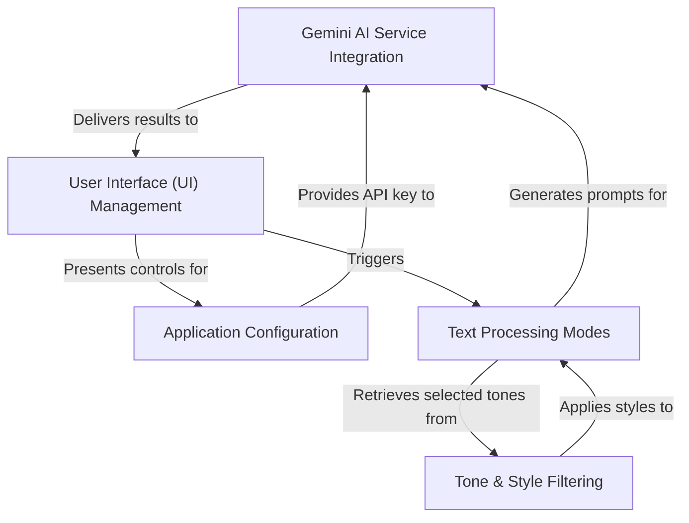

# Tutorial: banglaboost

BanglaBoost is an *AI-powered* web application designed to **enhance and transform Banglish/Bengali text**. It allows users to effortlessly improve their writing by **rewriting text in pure Bengali, translating it to English, or fixing grammatical errors**. The app integrates with the Gemini AI service to perform these intelligent text manipulations, offering a user-friendly interface with customizable tone and style options.

## Visual Overview

